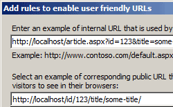

Access Protection
-----------------
Safeguard your Web server from malicious requests and unauthorized access with new URL authorization rules and built-in request filtering.

IIS 7.0 provides a secure, reliable platform for Web application and services hosting. New support for URL authorization and request filtering rules give administrators fine-grained control over access of site content.

## URL Authorization

IIS 7.0 stores URL authorization rules in an application's web.config file, so that the authorization rules which protect against unauthorized access follow the content, even if when content is moved to a different server or even a new domain. IIS 7.0 also supports ASP.NET URL authorization for all types of Web content requests in the integrated pipeline.

## Built-in Request Filtering

IIS 7.0’s Request Filtering allows administrators to implement URL acceptance polices both globally and per URL. Filtering requests helps secure the server by ensuring that only valid requests are processed. Administrators can increase Web server security by providing multiple filtering options that can prevent malicious or incorrect URLs from being processed. For example, using Request Filtering, an administrator can set a rule that prevents the display of files with certain file extensions, like .ini.

For IIS 5.1 and IIS 6.0 users, IIS provides URL Scan 3.0 which, like IIS 7.0 Request Filtering, restricts the types of HTTP requests that IIS will process. By blocking specific HTTP requests, the URL Scan 3.0 security tool helps to prevent potentially harmful requests from reaching applications on the server. URL Scan 3.0 screens all incoming requests to the server by filtering the requests based on rules that are set by the administrator. URL Scan 3.0 can be configured to filter HTTP query string values and other HTTP headers to mitigate SQL injection attacks against applications while the root cause is being fixed.

## URL Rewriting

Administrators can also use URL Rewriter for IIS 7.0, which enables dynamic modification of URLs based on rules defined by the site administrator, to protect applications on the Web server. For example, rules can be created which prevent other sites from ‘hot-linking’ to a Web site’s images or video content, thereby stealing content from the server and wasting bandwidth. Using rule templates, rewrite maps and other functionality integrated into IIS Manager, administrators can easily set up rules to define URL rewriting behavior based on HTTP headers and server variables.
