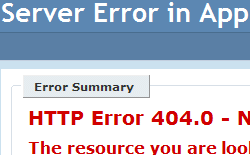
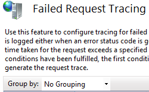

Rich Diagnostic Tools
---------------------

Minimize downtime and rapidly diagnose server and application issues with the built-in diagnostic tools.

## Detailed Errors

IIS simplifies troubleshooting by providing detailed and actionable error messages to server administrators. The custom errors module in IIS allows detailed error information to be sent back to the browser running on the local host server. Instead of seeing an error code, administrators can now see detailed information about the request, which potential issues may have caused the error, and suggestions about how to fix the error. The custom error information is only displayed to the server administrator; users of the Web site see the standard Web application error pages without the detailed information for server administrators.

## Automatic Failed Request Tracing

IIS makes it possible to troubleshoot failures without having to manually reproduce them. The Failed Request Tracing feature enables server administrators to define error conditions that they wish to monitor. This allows administrators to capture trace logs for a pre-configured failure condition automatically, all while avoiding the performance penalty of saving logs for all requests. With Failed Request Tracing, administrators can capture the valuable tracing information when errors occur, even if they are intermittent or hard to reproduce. If this feature is configured, and IIS detects an error condition, it can automatically log detailed trace events for everything that led to the error.

In addition, developers can instrument their application code with ASP.NET trace events. Failed Request Tracing will include the trace event information with the Failed Request Trace reports for a centralized troubleshooting experience. Failed Request Tracing helps any Web administrator, including Web hosters who manage many sites. A Web hoster can use Failed Request tracing for a single site or multiple sites to monitor for errors.
  
The underlying tracing infrastructure is exposed to IIS modules using the server extensibility model, allowing all IIS Extensions, whether they ship with IIS or are developed by third parties, to relay detailed tracing information during request processing. This allows developers and system administrators to create custom managed modules to take advantage of the unified tracing model. Developers can write tracing modules that provide new ways to process and output traces, like a module to save IIS tracing information to a Microsoft SQL Server® or to a text file.